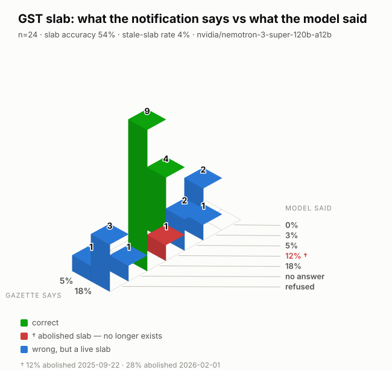

# Indian GST Rate-Slab Eval Harness

**Can a language model tell you what GST rate applies to a product — under the
rules that are actually in force?**

India's GST slabs were restructured twice in under two years. Notification
9/2025–CT(Rate) superseded the 2017 schedule on **22 September 2025**,
abolishing the **12 % slab** and introducing a 40 % demerit rate; Notification
19/2025 then omitted Schedule VII on **1 February 2026**, abolishing **28 %**
as well. Every model in this benchmark was trained on a web that is still
overwhelmingly describing the old table.

This repository is an open, human-labelled benchmark for classifying real Indian
product descriptions into the current GST slabs — and for measuring how often
models answer from a rate table that no longer exists.

> **Status: dataset in construction (week 1 of 6).** Nothing is claimed here
> that has not been measured. The leaderboard below is empty because no model
> has been run yet, and it will stay empty until one has been.

---

## Results

`data/golden.jsonl` exists and `harness.run` scores against it — but **all 24
rows are `gazette-derived`, not human-labelled.** Their slab was read out of
the hash-pinned notification and their heading out of each authority's
operative ruling; no human has confirmed either. See the provenance table under
*Dataset*. This is a working benchmark over an unaudited reference, and every
number below inherits that.

Dataset SHA `13b78aaeebab`, 24 rows, prompt `v1/shared`.

> An earlier run of this table, at SHA `8e0b639c6c6f`, was **scored against a
> corrupted dataset** and has been withdrawn. A redaction pattern was deleting
> `MS Rod`, `MS Flat` and `MS Bracket` — mild steel, not a party name — so
> those examples had no goods description left in them. Fixed in `1c29655`,
> data restored, re-run here. `tests/test_redaction_keeps_goods.py` now asserts
> that a goods description survives redaction, which nothing did before.

<picture>
  <source media="(prefers-color-scheme: dark)" srcset="docs/stale-slab-3d-dark.svg">
  
</picture>

| Model | Run | Slab acc. | HSN-4 acc. | Chapter acc. | Abolished **answered** | Abolished **recited** | p50 latency | ₹/correct |
|---|---|---:|---:|---:|---:|---:|---:|---:|
| `nvidia/nemotron-3-super-120b-a12b` | 2026-09-05 | 58.3 % | 66.7 % | 66.7 % | **0.0 %** | **20.8 %** | 19.3 s | — |

**Every one of those five stale responses was a refusal.** Not one abolished
rate appeared in an answer field — `stale_slab_rate` is zero — while a fifth of
all responses reasoned from a dead schedule and then declined:

| Example | Gazette | Answered | Cited |
|---|---|---|---|
| `gst-0046` | 5 % | `UNANSWERABLE` | 12 % |
| `gst-0048` | 18 % | `UNANSWERABLE` | 12 % |
| `gst-0051` | 18 % | `UNANSWERABLE` | 12 % |
| `gst-0068` | 18 % | `UNANSWERABLE` | 28 % |
| `gst-0086` | 18 % | `UNANSWERABLE` | 12 % |

A metric reading only the answer field would score this run as **perfectly
clean on staleness** while a fifth of its reasoning ran on a schedule that no
longer exists.

Cost is blank because NVIDIA's price for this model has not been read and
dated. The registry carries `0.0` deliberately, so the column stays empty
rather than carrying a fabricated figure.

**One run is not a measurement here.** The same 24 examples run five times
through `harness.probe` — identical inputs, identical references — give:

| Metric | Mean | Min | Max | Spread |
|---|---:|---:|---:|---:|
| Slab accuracy | 53.3 % | 45.8 % | 58.3 % | 12.5 pp |
| HSN-4 accuracy | 59.3 % | 56.5 % | 62.5 % | 6.0 pp |
| Abolished slab **answered** | 5.0 % | 0.0 % | 8.3 % | 8.3 pp |
| Abolished slab **recited** | **18.3 %** | 12.5 % | 25.0 % | 12.5 pp |
| Abstention accuracy | 77.5 % | 70.8 % | 83.3 % | 12.5 pp |

The benchmark run above sits at the **top** of the accuracy range and the
**top** of the recited range. Quote the spread, not the run. (Spread across
runs, *not* a confidence interval — see Limitations.)

Two things the run reports that the aggregate cannot:

- **Abstention F1 is `0.0`, and that is not a failure — it is an empty
  stratum.** No gold row is `UNANSWERABLE`, because a lookup cannot decide that
  a description is under-specified. The `unanswerable` stratum is 10 % of the
  target and stands at zero, so the metric has no positive class to score.
  Which is awkward, given a fifth of this run's responses were refusals: the
  benchmark currently cannot say whether a single one of them was *right* to
  refuse.
- **Nothing errored and nothing was unparseable** in this run. The previous
  run had one of each, both scored as wrong rather than dropped.

**The model answers the same prompt the same way only 62.5 % of the time** —
15 of 24 examples got an identical answer in all five runs. Taking the
plurality of five runs scores 58.3 %, five points above the mean single run, so
repetition buys something, but not much.

The instability is not noise around a settled answer. It crosses category
boundaries:

| Example | Gazette | Five answers |
|---|---|---|
| `gst-0068` | 18 % | `18`, `0`, **`28`**, `18`, `18` |
| `gst-0086` | 18 % | **`12`**, `18`, refused, refused, refused |
| `gst-0051` | 18 % | **`12`**, refused, **`12`**, **`12`**, **`12`** |
| `gst-0012` | 18 % | `18`, refused, **`9`**, `18`, refused |
| `gst-0088` | 5 % | refused, refused, refused, `5`, `18` |

`gst-0068` produced the abolished 28 % in one run of five and the correct
answer in three — a single run would have reported that example as either a
clean pass or the headline failure, depending entirely on luck.

`gst-0012` answering **9 %** is a different fault worth naming. The
notification prints its schedules as **CGST halves** — `Schedule II – 9 %`,
`Schedule III – 20 %` — and the combined GST rate is double. One response
handled that correctly ("attracts 9 % CGST … *resulting in a combined GST rate
of 18 %*") and another did not ("fixing the GST rate at 9 %"). That is a
correct reading of the document under the wrong convention, and it is invisible
to a stale-slab metric because 9 % is not an abolished slab — it was never a
GST slab at all.

Cost is **not** reported. NVIDIA's price for this model has not been read and
dated, and the registry carries `0.0` deliberately so no figure can be
fabricated. **Human ceiling:** still pending the self-agreement measurement,
which the 62.5 % above makes considerably more urgent. A model that reproduces
its own answer five times running on only 15 of 24 examples has to be judged
against a human doing the same task twice, and that number does not exist yet.

---

## The headline finding

The hypothesis, recorded before any model was run so it could not be
retrofitted:

> Frontier models will classify goods into a **superseded** slab structure,
> emitting one of the two abolished rates — 12 % or 28 % — on a measurable
> share of items, and will do so with no drop in stated confidence.

**Partly supported, and the qualifier matters more than the number.**

Measured the way the hypothesis was originally written — abolished rates given
as the *answer* — it averages **5.0 %** over five runs, and in one of those
runs it was **zero**. That does not vindicate a prediction of "a measurable
share".

Measured the way the responses actually behave, **18.3 % (12.5–25.0 %) reason
from a rate that no longer exists**. Most of those never put it in the answer
field; they cite it and then decline. The failure is real and roughly four
times more common than the original metric could see — but it mostly surfaces
as an abstention, which is a materially different claim from "models will
confidently emit abolished rates", and this section should not pretend
otherwise.

The stated hypothesis also predicted "no drop in stated confidence". That is
the part the evidence contradicts: reasoning from a dead schedule is precisely
what pushes this model *toward* refusing. Abstention accuracy of 77.5 % with
refusals concentrated on questions the notification answers plainly is the
shape of a model that knows it is unsure — not one confidently reciting.

Three things complicate the reading further, and all three point at the
benchmark rather than the model.

**The probe set barely contains the cases the hypothesis is about.** Only 2 of
the 24 goods have a rate that moved in 2025. A model cannot recite a superseded
rate for goods whose rate was never superseded. The `rate-changed-2025` stratum
is the whole experiment, and it is the stratum that is least populated.

**The original metric undercounted by 5×, and this is how it was found.**
`stale_slab` inspects only the answer field, so a refusal that arrives *by way
of* an abolished rate scored as a clean abstention:

> "The goods comprise slide fasteners (12 % GST) and parts/sliders (18 % GST),
> so no unique rate can be assigned."
>
> "…two distinct products with different GST rates (5 % for bricks, 12 % for
> blocks), so a single rate cannot be determined."
>
> "Heading 4911 (Other printed matter) is taxed at 12 % under the GST rate
> schedule for printed advertisement materials."

Reading those by hand is what prompted `stale_cited_rate`, which counts an
abolished rate asserted as current anywhere in the response. It moved the
figure from a mean of 5.0 % to 18.3 %. Both are reported: a model that gives a wrong rate
and one that declines for a wrong reason are different failures, and collapsing
them would hide which is happening.

**A hand-checked case outside the probe set is unambiguous.** Asked to classify
*Portland cement, 50 kg bag*, the model twice answered **28 %** — abolished on
1 February 2026 when Notification 19/2025 omitted Schedule VII — and justified
it: *"the GST schedule entry for 2523 fixes the rate at 28 % GST (plus
applicable cess)"*, cess being the other half of a structure that no longer
applies. The archived Gazette puts heading 2523 in Schedule II at 18 %,
unambiguously. Two calls are an anecdote; the point is that the failure mode is
real and this probe set is not built to catch it.

So the finding as it stands: **the model's dominant failure here is ordinary
wrongness (46 %), not staleness — but the staleness that does appear is
confident, and hides inside refusals where the metric cannot see it.** The next
run needs the rate-changed stratum populated and the scorer widened, and this
section will be rewritten against whatever that shows.

---

## Why this task

| Criterion | How this task meets it |
|---|---|
| **Narrow enough to label** | One product description in, one slab out. |
| **Real, messy data** | Open Food Facts India, advance rulings, government catalogues. Nothing synthetic — see [`data/DATA_LICENCE.md`](data/DATA_LICENCE.md). |
| **Not already benchmarked** | No public GST/HSN benchmark exists. The nearest work, [ATLAS](https://arxiv.org/pdf/2509.18400), covers **US** HTS codes. |
| **Verifiable** | Ground truth is a published legal instrument, not an opinion. |
| **Has a hard core** | Pre-packaged-and-labelled conditionality, GRI 3 sets, parts rules, and a rate table that moved under the models' feet. ATLAS reached only 40 % exact at the 10-digit level, so this will not be a leaderboard where everything scores 97 %. |

---

## Methodology

### Dataset

- **Target size** 400 examples. Below ~200 the confidence intervals are too wide
  to support any claim; past ~600 the labelling cost stops buying information.
- **Stratified, not sampled**: 40 % typical · 25 % hard · 15 % long-context ·
  10 % adversarial · 10 % **unanswerable**.
- That last stratum is the point. Models that answer confidently when the
  description does not determine a rate fail in production, and almost no
  benchmark tests for it.
- **Two sources, chosen for different strata:**

  | Source | Supplies | Why |
  |---|---|---|
  | Open Food Facts (India) | `typical` | Real packaged-goods listings, short and messy, ODbL-licensed |
  | GST Advance Rulings | `hard`, `adversarial`, `long_context` | Genuine classification disputes across the whole tariff — "does a quartz slab that is 92% crushed quartz and 8% resin fall under 6802 or 6810?" — with the applicant's rejected contention left in as a distractor |

- **Every row records who decided it, and right now none of them is a human.**
  `labelled_by` takes four values, and the distinction is the dataset's central
  claim, so it is stated before any result:

  | `labelled_by` | Meaning | Count |
  |---|---|---:|
  | `human` | judged directly by the annotator | **0** |
  | `human-reviewed` | model suggestion the annotator accepted or corrected | **0** |
  | `gazette-derived` | slab read from the archived notification, heading from the authority's operative ruling, **no human confirmed it** | **24** |
  | `model-first-pass` | unreviewed suggestion — rejected by the validator, quarantined in `data/first_pass.jsonl` | — |

  A `gazette-derived` row contains nothing recalled: the heading comes from the
  ruling's own operative paragraph via `ruling_outcome`, and the slab from
  `schedule_lookup`, which reads `data/reference/primary/` and refuses any
  heading appearing in more than one schedule. A model's recollection of Indian
  GST rates is the pre-2025 table — the error this benchmark measures — and
  none of it is used to produce them. That is the entire argument for admitting
  them, and it does not extend one inch further:

  - they **cannot** fill `hard` or `adversarial`, which exist for exactly the
    calls a lookup cannot make, and both stand at zero;
  - they **cannot** serve as the human ceiling, which needs a human labelling
    twice and so does not exist yet;
  - any score over them belongs beside a human-labelled score, never averaged
    into one.

  `python -m harness.label.cli --review-first-pass` promotes a derived row to
  `human-reviewed` when an annotator gets to it. Until then this dataset
  measures a document lookup's agreement with a model, not a human's.

- **Model assistance, disclosed.** A model first pass runs over the collected
  rulings. It **never recalls a slab** — deriving one needs Notification
  9/2025, and a model's priors are the pre-2025 table, which is the very error
  this benchmark measures. It proposes the HSN heading, read out of the
  authority's own operative ruling in the same document, and where that heading
  resolves to exactly one entry in the archived Gazette it reports that entry
  as a *lookup*, quoting the text.

  Over 129 collected rulings: 63 yield a heading, 24 of those resolve to a
  single Gazette entry, and 38 span several schedules and are left for the
  annotator — 2202 turns on added sugar, 7418 on whether an article is a
  household article of copper, 9608 on pens versus pencils.

  Those suggestions live in `data/first_pass.jsonl`, never in the golden set.
  They are marked `labelled_by: "model-first-pass"`, which
  `harness/schema.py` rejects outright — concatenating the two files fails
  validation rather than silently laundering an unreviewed label. A suggestion
  becomes an example only after a human reviews it, at which point it is
  rewritten as `human-reviewed`, and the quarantine file is left intact as the
  record of what was proposed.
- Examples are **never edited in place**. A correction is appended under a new
  id and the old row carries `deprecated_by`.

#### The `rate-changed-2025` stratum

This slice carries the headline finding, and not every rate change is equally
useful for it.

The **22 September 2025** moves were mostly 18 % → 5 % (hair oil, shampoo,
toothpaste, toilet soap). Both of those rates are still live, so a model
reciting the old one looks like an ordinary wrong answer and the stale-slab
metric cannot see it at all.

The **1 February 2026** moves are the sharp probe, because the rate they moved
*from* was abolished. Notification 19/2025 did not merely delete Schedule VII —
it relocated every entry in it, and split one:

| Goods | Heading | To 31 Jan 2026 | From 1 Feb 2026 |
|---|---|---|---|
| Pan masala | 2106 90 20 | 28 % | **40 %** |
| Unmanufactured tobacco | 2401 | 28 % | **40 %** |
| Cigars, cheroots, cigarillos, cigarettes | 2402 | 28 % | **40 %** |
| Other manufactured tobacco | 2403 *excl. biris* | 28 % | **40 %** |
| **Biris** | 2403 19 21, 2403 19 29 | 28 % | **18 %** |
| Tobacco / nicotine for inhalation | 2404 11 00, 2404 19 00 | 28 % | **40 %** |

A model answering 28 % for any of these is quoting a rate that no longer
exists. The biri split is sharper still: a model that has half-updated may put
biris at 40 % with the rest of tobacco.

All of it is derived from two hash-pinned documents in
`data/reference/primary/` — no press notes, no recall. `AMENDED_2026` in
`harness/collect/schedule_lookup.py` carries the transcription, and
`tests/test_notification_19.py` matches every row of it against the archived
PDF's own text, so the code cannot drift from the document.

Ground truth authority: [`data/reference/rate_schedule.md`](data/reference/rate_schedule.md).
Annotation protocol: [`data/guideline.md`](data/guideline.md).

### Scoring

Cheapest method that works, escalating only where forced:

| Field | Method | Why |
|---|---|---|
| `slab` | **Exact match** | Closed label set. Free, fast, unarguable. |
| `hsn4` | **Exact match**, plus 2-digit chapter as partial credit | Structured. |
| `answerable` | **Exact match**, reported as abstention precision/recall/F1 | Binary. |
| `justification` | **LLM-as-judge** | Genuinely open-ended — the only place a judge is warranted. |

A benchmark that judges everything with an LLM has reached for the fashionable
tool. Three of the four fields here never touch a judge, and they are
implemented in `harness/scorers/exact.py` — no model is involved in any of them.

**Stale-slab rate is scored separately**, not folded into accuracy, and is
broken down by which abolished rate was quoted. "Wrong" and "reciting a
schedule that no longer exists" are different failures, and only the second is
the finding.

**Two stale-slab numbers are reported, not one.** `stale_slab_rate` counts
abolished rates given as the *answer*. `stale_cited_rate` also counts them
where they appear anywhere in the response, because a model can recite a dead
schedule and then decline on the strength of it:

> "The goods comprise slide fasteners (12 % GST) and parts/sliders (18 % GST),
> so no unique rate can be assigned."

That scored as a clean abstention. It is the same failure as answering 12 %,
wearing different clothes. The cited rate is always ≥ the answered rate, and
the gap is exactly those refusals.

Getting the history *right* is the opposite of staleness, so a mention wrapped
in historical language — "the rate **was** 12 % **until** 22 September 2025",
"the **erstwhile** 28 % rate **no longer** applies" — is not counted. That is a
heuristic over free prose, it will be imperfect in both directions, and it is
reported as its own metric rather than folded into the headline so the
judgement it makes stays visible and arguable.

**Failed and unparseable responses score as wrong**, never as skipped.
Dropping them would inflate accuracy for whichever model errors most.

**One prompt for every model** (`harness/prompt.py`, versioned). A separately
reported second pass gives each model a lightly tuned prompt; the gap between
the two passes is itself a result.

### Judge calibration

The judge scores one field — `justification` — and asks one question: **did the
model reach its answer by a route that would generalise?** That is not "was the
answer right". The rubric fails a right answer reached by a route that gets the
next example wrong, fails reasoning resting on a superseded notification, and
explicitly protects sound reasoning that is tersely or oddly worded.

```bash
python -m harness.calibration.judge_calibration --verdicts <file>
```

The report gives Cohen's κ, the confusion matrix, the **direction** of error
(too lenient vs too strict — different problems with different fixes), and
**every disagreement listed in full** with the goods, the gold answer, the
explanation and both verdicts. Categories are *suggested*, never assigned: a
model grading its own failure modes is circular, so the categorisation is the
annotator's and it is the finding.

κ is reported whatever it comes out at, and the report says so in its own words
when the judge is unusable. κ is computed by the same function as the human
self-agreement check, so the judge is held to exactly the measure the annotator
was — a test pins that they are literally the same function.

| κ | Reading |
|---|---|
| < 0.40 | Judge is unusable. Fix the rubric. |
| 0.40–0.60 | Moderate. Usable with caveats, stated. |
| 0.60–0.80 | Substantial. A good result. |
| > 0.80 | Strong — check the task has not been made trivially easy. |

**The rubric is v1 and provisional**, written before any disagreement data
existed — which is the wrong order, and the calibration report exists to
correct it. `RUBRIC_VERSION` is stamped on every verdict so a κ figure can
always be traced to the rubric that produced it.

| kappa | Reading |
|---|---|
| < 0.40 | Judge is unusable. Fix the rubric. |
| 0.40–0.60 | Moderate. Usable with caveats, stated. |
| 0.60–0.80 | Substantial. A good result. |
| > 0.80 | Strong — check the task has not been made trivially easy. |

### Cost

Every call logs `tokens_in`, `tokens_out`, `latency_ms`, `provider`, `model`
and per-1k prices, so the leaderboard can report the metric almost nobody
publishes:

```
cost_per_correct_answer = total_cost / number_of_correct_answers
```

This reorders leaderboards. A model at 84 % for ₹0.30 per correct answer beats
one at 89 % for ₹2.10 in most real deployments.

_Prices will be stated with the date they were read._

---

## Reproducing

Python 3.11+. Labelling, validation and self-agreement need **no dependencies** —
they run on a fresh clone before any `pip install`.

```bash
make validate    # schema + composition checks on the golden set
make test        # unit tests
make label       # interactive labelling
```

Rebuilding the corpus needs `pypdf`, because advance rulings are published as
PDFs:

```bash
pip install -e ".[collect]" && make collect
```

Model runs (week 4 onward) need API keys; copy `.env.example` to `.env`.

### Running the open-weight model on your own GPU

The open-weight row is deliberately a model with a **published container**, so
self-hostability is demonstrable rather than inferred. The same row can be
reproduced locally — a NIM container serves the same OpenAI-compatible format,
so the only thing that changes is the base URL:

```bash
docker run -it --rm --gpus all --shm-size=16GB \
  -e NGC_API_KEY -v "$LOCAL_NIM_CACHE:/opt/nim/.cache" -u $(id -u) -p 8000:8000 \
  nvcr.io/nim/nvidia/llama-3.3-nemotron-super-49b-v1.5:latest
```

```bash
python -m harness.run --model open-weight-local    # hits localhost:8000
```

`NIM_BASE_URL` points it elsewhere if the GPU is on another machine. Running
both `open-weight` (hosted) and `open-weight-local` (self-hosted) is a useful
check in itself: the same weights behind two serving stacks should score the
same, and a gap means the serving configuration differs, not the model.

This is the bridge to Project 03 — the same model, the same harness, running
where you control it.

---

## Limitations

Written honestly, and expanded as the work proceeds.

- **Every figure currently published rests on n = 24, and the interval is
  wider than the finding.** At that sample size a measured rate of 20 % carries
  a 95 % confidence interval of roughly ±16 points — so "18.3 % recite an
  abolished slab" is really "somewhere between about 3 % and 34 %". Repeating
  the run fixes sampling noise, and `--repeats` now reports mean and range for
  exactly that reason, but **repeats do not narrow this interval**: five runs
  over the same 24 examples is still 24 examples. Only more labelled examples
  will do it, which is what the 400-example target is for. Any range quoted in
  the Results table is the spread across runs, not a confidence interval, and
  the two should not be confused.
- **Single annotator.** Self-agreement bounds this dataset, but it cannot detect
  a mistake made consistently. A second annotator would; there isn't one.
- **The model does not agree with itself.** Two identical runs of the same 24
  prompts disagreed on 4 answers (17.4 %), three of them flipping from correct
  to wrong, and slab accuracy moved 4.2 points on sampling alone. This is
  sampling noise of the same magnitude as the effect being measured, and it
  means single-run numbers from this harness are indicative at best.
- **The judge may share a family with a benchmarked model.** Where it does, a
  self-preference effect cannot be ruled out from κ alone. The judge model is
  recorded on every run so the overlap is visible rather than implicit.
- **Ground truth has a shelf life.** GST notifications are amended. Labels are
  correct as of the date in `data/reference/rate_schedule.md` and no longer.
- **Alcohol is the only excluded family.** Alcoholic liquor for human
  consumption is outside GST by constitutional exclusion, so it has no slab to
  predict. Cement, aerated drinks, tobacco and pan masala were all excluded
  early on the mistaken premise that Schedule VII's fate was unknown; reading
  the Gazette settled every one, and all are now in scope. For tobacco, note
  that the separate excise duty introduced alongside the 40 % rate is a
  different levy and does not change which GST slab applies.
- **Source skew.** Open Food Facts is packaged food, concentrating that half of
  the corpus in Chapters 1–24. Advance rulings spread across the tariff and
  correct much of this, but the two sources differ in register as well as
  subject: a listing is a dozen words, a ruling excerpt is several hundred. A
  model's score is therefore partly a score on input length, and per-source
  results are reported separately for that reason.
- **Descriptions are reassembled** from catalogue fields (brand, name, quantity,
  packaging), which is tidier than a real marketplace listing. Concatenation
  only — no text is generated — but it is not identical to production input.
- **Advance rulings are survivorship-biased.** A dispute only reaches an
  authority when the classification was contentious, so this slice is harder
  than the population of goods a real system meets. It is not a random sample
  and is not presented as one.
- **Roughly three quarters of ruling PDFs are scans** with no text layer and are
  skipped, and files above 1.5 MB are skipped before download as probable scans.
  Both filters bias the ruling slice toward authorities that publish digitally —
  Tamil Nadu, Gujarat, West Bengal and Karnataka are over-represented relative
  to their share of rulings.

  Measured across 158 index pages (150–307): **1,580 rows → 456
  classification-of-goods rulings → 92 usable excerpts**. The attrition is
  almost entirely scans (243) plus rulings with no locatable facts section (54),
  with smaller losses to oversized files, withdrawn applications and duplicates.
  Recovering oversized files yielded only 4 usable rulings from 14 downloaded,
  which is the evidence for skipping them: oversized really does mean scanned.

  Pages 0–149 hold newer rulings and are far worse — a sample showed 27 of 28
  classification rulings were scans, against roughly half in the older range —
  so the practical ceiling is close to the 92 already collected. The ruling
  sources therefore cannot fill `hard`, `long_context` and `adversarial` alone.
  Open Food Facts supplies the remainder of `hard` through
  pre-packaged-and-labelled conditionality, and most of `out_of_scope` through
  listings too vague to classify.
- **Ruling excerpts are cut by pattern matching**, not by understanding. The
  segmenter stops before the authority's findings so the answer cannot leak, and
  refuses to emit anything when it cannot locate the facts section — but it can
  still start a few sentences early or late.
- **Goods only.** Services are out of scope, and are filtered out of the ruling
  stream because CGST s.97(2)(a) covers "goods **or services** or both".

---

## Licence

Code: MIT — see [`LICENSE`](LICENSE).
Dataset: **ODbL 1.0**, being a derived database of Open Food Facts.
Provenance for every example: [`data/DATA_LICENCE.md`](data/DATA_LICENCE.md).

> Contains information from Open Food Facts, made available under the
> [Open Database License (ODbL) v1.0](https://opendatacommons.org/licenses/odbl/1-0/).
